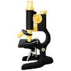

Automated detection of nuclei and DNA damage in Caenorhabditis elegans germline
===

The `NUKE-BREAK` macro for the program ImageJ ([Schneider et al. 2012](https://www.ncbi.nlm.nih.gov/pmc/articles/PMC5554542/)) was developed specifically to detect RAD-51 foci within nuclei in the C.elegans gonad, but can be applied to the detect and count any type of round particles. The macro was designed to automatically detect and process batches of microscope stacks (.tif) acquisitions of this organ. To this end, key parameters for nuclei and foci detection (minimum and maximum surface and circularity) have been optimized for the mitotic and meiotic regions of the gonad.

The macro processes all detected `.tif` files follows:
1. The `DAPI` and `RAD-51` staining channels are automatically assigned using preexisting blue and red LUT.
2. The noise of both channel is then independently removed using the [“substract background” function](http://ieeexplore.ieee.org/document/1654163/?reload=true).
3. The `DAPI` channel is then used to detect the Gonade within the image by combining [Z projections](https://www.biotechniques.com/biotechniques/BiotechniquesJournal/supplements/2007/July/ImageJ-for-microscopy/biotechniques-42894.html) and the ["Huang" thresholding method](https://pdfs.semanticscholar.org/8906/64d6e7861253bd8c36d0e9079f96c9f22d67.pdf). A further analysis of the Gonad allows the automatic detection of its orientation and the position of its distal end. The position of every nuclei will be calculated using this reference point.
4. Nuclei are then detected by thresholding, for every slice, the pixel values present within G using the “Default” algorithm. As a nucleus is present on several slices, all particles having the same centroid are removed except of the one with the largest area value.
5. `RAD-51` foci are then scored independently for each nucleus. In order to take into account the 3D shape of the nuclei, a Z projection is performed. `RAD-51` foci are then detected within the shape of the nucleus using the [“Max-Entropy” threshold method](https://www.sciencedirect.com/science/article/pii/0734189X85901252).
6. Finnaly, the program collects the position and size of all nuclei and foci to generate cumulative distribution curves over distance from the extremity of the gonad .

For more details please refer to our publication.

||||
|-------------------------------------|-----------------------------------|-----------------------------------|-----------------------------------|
|**ORIGINAL 3D CELL**   |**IDENTIFIED "BEST" SLICE**   |**AUTOMATED DETECTION OF THE SEGMENTS**   |**AUTOMATED CALCULATION OF THE RADIUS OF CURVATURE**   |

**Contributors**
--

|    ||
|-----------------------------|------------|
|**CLUET David**|     [david.cluet@ens-lyon.fr](david.cluet@ens-lyon.fr)|
|**MICHAL Fanny**|     |

**Publication**
--

**The C. elegans SET-2/SET1 histone H3 Lys4 (H3K4) methyltransferase preserves genome stability in the germline.**

M. Herbette, M.G. Mercier, F. Michal, D. Cluet, C. Burny, G. Yvert, V.J. Robert, F. Palladino

[*DNA Repair (Amst). 2017 Sep;57:139-150. doi: 10.1016/j.dnarep.2017.07.007. Epub 2017 Jul 29.*](https://www.sciencedirect.com/science/article/pii/S1568786417302707?via%3Dihub)

Author information:

Laboratory of Molecular Biology of the Cell, Ecole Normale Supérieure de Lyon,
Centre National de la Recherche Scientifique, Lyon, France.

License
--

Copyright CNRS 2013

>This software is a computer program whose purpose is to **automatically identify segments of the cytoplasmic membrane and calculate their radius of curvature**.
>
>This software is governed by the CeCILL  license under French law and abiding
by the rules of distribution of free software. You can use, modify and/ or
redistribute the software under the terms of the CeCILL license as circulated
by CEA, CNRS and INRIA at the following URL:
http://www.cecill.info/index.en.html
>
>As a counterpart to the access to the source code and  rights to copy, modify
and redistribute granted by the license, users are provided only with a limited
warranty  and the software's author,the holder of the economic rights, and the
successive licensors have only limited liability.
>
>In this respect, the user's attention is drawn to the risks associated with
loading, using, modifying and/or developing or reproducing the software by the
user in light of its specific status of free software, that may mean  that it
is complicated to manipulate, and that also therefore means  that it is
reserved for developers  and  experienced professionals having in-depth
computer knowledge. Users are therefore encouraged to load and test the
software's suitability as regards their requirements in conditions enabling
the security of their systems and/or data to be ensured and, more generally,
to use and operate it in the same conditions as regards security.
>
>The fact that you are presently reading this means that you have had knowledge
of the CeCILL license and that you accept its terms.

**Requirements**
--
The `FIND_CURVE` macro requires `ImageJ v1.49g` or higher ([Download](https://imagej.nih.gov/ij/download.html)).

For ImageJ, the conversion of the analyzed stacks into animated GIFs requires the ([Gif-Stack-Writer Plugin](https://imagej.nih.gov/ij/plugins/gif-stack-writer.html)).

**Files**
--
- [] **src**
    - README.md
    - LICENSE
    - `Installation.ijm`
    - `Installation_FIJI.ijm`
    - [] **doc**
        - *3D.jpg*
        - *FIJI.jpg*
        - *Identification.jpg*
        - *IJ.jpg*
        - *Logo_cnrs.jpg*
        - *Logo_ens.jpg*
        - *Logo_LBMC.jpg*
        - *Segment.jpg*
        - *Slice.jpg*
    - [] **macro**
        - `CleanMemory.java`
        - `CloseImage.java`
        - `CNRS.jpg`
        - `ENS.jpg`
        - `Explorer.java`
        - `Find_Curve.java`
        - `HTML_Curve.html`
        - `LBMC.jpg`
        - `macro_AboutPlugin.java`
        - `Main.java`
        - `ROIeraser.java`
        - `Startup_CL.txt`
        - `style_Curve.css`
        - `tableline.html`
        - `Trigo.tif`
        - `UCBL.jpg`

**Installation**
--
The `NUKE-BREAK` macro can be automatically installed with all required files in `ImageJ` and `FIJI`. Please follow the specific instructions described below.

---
1. Open `ImageJ`.
2. Open the `src` folder of the `NUKE-BREAK` macro.
3. Drag the `Installation.ijm` file on `ImageJ` Menu bar to open it.
4. In the Menu bar of the macro select the `Macros/Run Macro` option.
5. The window will be closed automatically and all required files will be installed in the `ImageJ/macros/NUKE-BREAK` folder. The shortcut `Plugins/Macros/NUKE-BREAK` will be added in the Menu bar.
6. A second shortcut `ImageJ/macros/NUKE-BREAK_Table` is generated to allow the generation of cumulative curve after a human quality control (if required).
7. Restart `ImageJ` to refresh the Menu bar.

---
1. Open `FIJI`.
2. Open the `src` folder of the `NUKE-BREAK` macro.
3. Drag the `Installation_Fiji.ijm` file on `FIJI` Menu bar to open it.
4. In the console select the `Run` option.
5. All required files will be installed in the `Fiji.app/macros/NUKE-BREAK` folder. The shortcut `Plugins/Macros/NUKE-BREAK` will be added in the Menu bar.
6. 6. A second shortcut `ImageJ/macros/NUKE-BREAK_Table` is generated to allow the generation of cumulative curve after a human quality control (if required).
7. Restart `FIJI` to refresh the Menu bar.

**Update**
---
Follow the same instructions as for the installation process.
